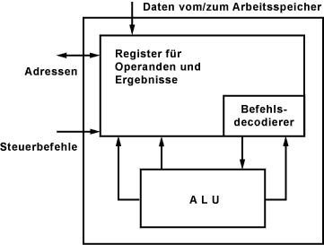
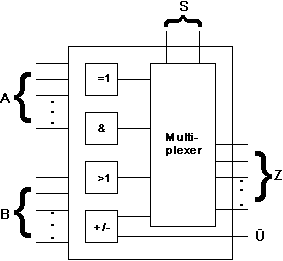

---
tags:
    - Aufbau & Funktion
---

# Arithmetic Logic Unit (ALU) / Rechenwerk

Das **Rechenwerk** ist der eigentliche Rechner. Es wird als Arithmetic Logic Unit, kurz **ALU**, bezeichnet. In der ALU werden alle **arithmetische** und **logische** Funktionen und Berechnungen ausgeführt. Zur ALU gehören auch der [Akku](Register.md) (Speicher) und die **Flags** (Ereignisspeicher).
Durch das Rechenwerk wird das Befehlswerk in die Lage versetzt Daten zu verarbeiten.

## Aufbau

Ein [Mikroprozessor](../Micro/Microprozessor.md) besitzt die Fähigkeit Daten zu verarbeiten. Dazu gehört es auch, Zahlen zu berechnen, sie logisch zu verknüpfen und das Ergebnis auszugeben. Alle **mathematischen** und **logischen** Vorgänge in einem Mikroprozessor werden von der ALU ausgeführt.

Die ALU ist eine Universal-Schaltung, die zwei n-Bit Datenworte wahlweise:

-   addiert
-   subtrahiert
-   UND-verknüpft
-   ODER-verknüpft
-   XOR-verknüpft

_[Quelle](https://www.elektronik-kompendium.de/sites/com/1310171.htm)_

## FPU - Floating Point Unit

Da das ursprüngliche Rechenwerk, die ALU, für vielerlei Verarbeitungsprozesse wenig geeignet war, wurden zusätzliche Recheneinheiten entwickelt, die für bestimmte Aufgaben optimiert wurden.

## MMU - Memory Management Unit

Die MMU ist ein wichtiger Teil eines Prozessors, wenn es darum geht, Teile des Speichers zu reservieren, um Software in geschützten Bereichen ablaufen lassen zu können. Sonst würde man ständig Gefahr laufen, dass parallel laufende Applikationen sich gegenseitig überschreiben würden. Die Folge wäre, dass ein solcher Fehler das Gesamtsystem zum Absturz bringen würde.
