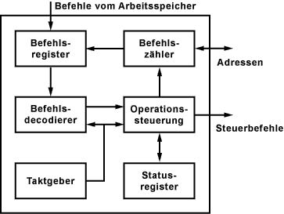

---
tags:
    - Aufbau & Funktion
---

# Control Unit (CU) / Steuerwerk / Leitwerk / Befehlswerk

Die Control Unit (**CU**) bzw. das Steuerwerk wird in mancher Literatur auch als Leitwerk oder Befehlswerk bezeichnet. Das Steuerwerk ist die Steuereinheit, die für die **Zusammenarbeit** der einzelnen Teile des Prozessors verantwortlich ist. Für die Aufgaben des Steuerwerks steht ein internes Bussystem zur Verfügung.

## Aufgaben

-   Lesen von Daten aus dem RAM
-   Speichern von Daten im RAM
-   Bereitstellen, Decodieren und Ausführen eines Befehls
-   Verarbeiten der Eingaben von peripheren Geräten
-   Verarbeiten von Ausgaben an periphere Geräte
-   Interrupt-Steuerung
-   Überwachung des gesamten Systems

## Aufbau

Im Steuerwerk befindet sich das **Befehlsregister**, das alle Befehle enthält, die der Prozessor ausführen kann. Hier werden auch die Befehle dekodiert. Der Befehlsdecoder übersetzt die Befehle und übergibt sie der Ausführungseinheit, die den Befehl dann ausführt. Die **Ausführungseinheit** übergibt die Daten zur Berechnung an das [Rechenwerk](ALU.md) und erhält von dort das Ergebnis zurück. Wichtige Daten, die während der Ausführung gebraucht werden, werden in Registern zwischengespeichert. Ein **Register** ist der schnellste Speicher in einem Prozessor.
Dann gibt es noch eine zeitliche und logische Steuerung, die auf das Rechenwerk bei Rechenoperationen zugreift. Von hier wird auch der Steuerbus, die Interrupts und die serielle Ein- und Ausgabe gesteuert.

_[Quelle](https://www.elektronik-kompendium.de/sites/com/1310171.htm)_
