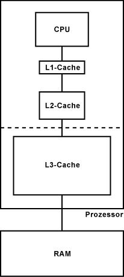

---
tags:
    - Aufbau & Funktion
---

# Cache

Der Cache ist ein spezieller **Puffer**-Speicher, der zwischen dem **Arbeitsspeicher** und dem **Prozessor** liegt.
Damit der Prozessor nicht jeden Programm-Befehl einzeln aus dem langsamen Arbeitsspeicher holen muss, wird gleich ein ganzer Befehls- bzw. Datenblock vom Arbeitsspeicher in den Cache geladen. Die Wahrscheinlichkeit, dass die nachfolgenden Programmbefehle im Cache liegen, ist relativ hoch. Erst wenn alle Programm-Befehle abgearbeitet sind oder ein Sprungbefehl zu einer Sprungadresse **ausserhalb des Caches** führt, dann muss der Prozessor erneut auf den Arbeitsspeicher zugreifen. Deshalb sollte der Cache möglichst gross sein, damit der Prozessor die Programm-Befehle ohne Wartezeit hintereinander ausführen kann.

In der Regel arbeiten Prozessoren mit mehrstufigen Caches, die unterschiedlich groß und schnell sind. Je **näher** der Cache am Rechenkern ist, desto kleiner und schneller arbeitet er.

_[Quelle](https://www.elektronik-kompendium.de/sites/com/0309291.htm)_

## Zweck

Der primäre Zweck eines Cache ist es, die **Zugriffszeit auf wichtige Daten zu reduzieren**. Als _„wichtige“_ Daten gelten:

-   Daten, die häufig benötigt werden: In diesem Fall wäre es verschwenderisch, die Daten immer wieder aus dem hinter dem Cache liegenden, langsameren Speicher zu laden. Stattdessen werden diese mit kürzerer Zugriffszeit aus dem Cache ausgeliefert.

-   Daten, deren Erzeugung ein aufwendiger Prozess zugrunde liegt: Manche Daten sind das Ergebnis einer rechenintensiven Verarbeitung, oder die Daten müssen aus verschiedenen Teilen zusammengefügt werden. In diesen Fällen bietet es sich an, die fertigen Daten für weitere Abfragen in einem Cache zu speichern.

-   Daten, die zusammen benötigt werden: In diesem Fall wäre es ineffizient, die Daten erst dann zu laden, wenn Sie abgerufen werden. Stattdessen ist es sinnvoll, die Daten gemeinsam im Cache vorzuhalten.

## Grundlegendes Cache-Schema

Eine Anfrage nach einer Ressource wird an das System bzw. die Software, die über einen Cache verfügt, gestellt.

1. Ist die Ressource bereits im Cache enthalten, wird sie aus dem Cache ausgeliefert. Dieser Fall wird als „**Cache Hit**“, also „Cache-Treffer“, bezeichnet.

2. Ist die Ressource nicht im Cache enthalten, wird sie zunächst aus dem dahinterliegenden System in den Zwischenspeicher geladen und anschließend ausgeliefert. Dieser Fall wird als „**Cache Miss“**, in etwa „Cache-Fehlschuss“, bezeichnet.

3. Wird dieselbe Ressource in der Zukunft erneut abgefragt, kann sie ebenfalls als Cache Hit aus dem Cache ausgeliefert werden.

## Layers

### L1-Cache / First-Level-Cache

In der Regel ist der L1-Cache nicht besonders groß. Aus Platzgründen bewegt er sich in der Größenordnung von 16 bis 64 kByte. Meistens ist der Speicherbereich für Befehle und Daten voneinander getrennt. Die Bedeutung des L1-Caches wächst mit der höheren Geschwindigkeit der CPU.
Im L1-Cache werden die am häufigsten benötigten Befehle und Daten zwischengespeichert, damit möglichst wenige Zugriffe auf den langsamen Arbeitsspeicher erforderlich sind. Dieser Cache vermeidet Verzögerungen in der Datenübermittlung und hilft dabei die CPU optimal auszulasten.

### L2-Cache / Second-Level-Cache

Im L2-Cache werden die Daten des Arbeitsspeichers (RAM) zwischengespeichert.
Über die Größe des L2-Caches versorgen die Prozessorhersteller die unterschiedlichen Marktsegmente mit speziell modifizierten Prozessoren. Die Wahl zwischen einem Prozessor mit mehr Taktgeschwindigkeit oder einem größeren L2-Cache lässt sich vereinfacht wie folgt beantworten: Mit einem höheren Takt laufen einzelne Programme, insbesondere mit hohem Rechenbedarf, schneller. Sobald mehrere Programme gleichzeitig laufen, ist ein größerer Cache von Vorteil. In der Regel sind normale Desktop-Computer mit einem Prozessor, der einen großen Cache hat, besser bedient, als mit einem Prozessor, der eine hohe Taktrate hat.
Als der Speichercontroller vom Chipsatz in den Prozessor verlagert wurde und der Prozessor damit viel schneller auf den Arbeitsspeicher zugreifen konnte, sank damit die Bedeutung des L2-Caches. Während die Größe des L2-Caches geringer wurde, wurde der L3-Cache ordentlich aufgerüstet.

### L3-Cache / Third-Level-Cache

In der Regel verwenden Multicore-Prozessoren einen integrierten L3-Cache. Mit dem L3-Cache kann das Cache-Koheränz-Protokoll von Multicore-Prozessoren viel schneller arbeiten. Dieses Protokoll gleicht die Caches aller Kerne ab, damit die Datenkonsistenz erhalten bleibt. Der L3-Cache hat also weniger die Funktion eines Caches, sondern soll das Cache-Koheränz-Protokoll und den Datenaustausch zwischen den Kernen vereinfachen und beschleunigen.

## Arten

### Hardware-Caches

#### Prozessor-Cache

Ein moderner Prozessor arbeitet unglaublich schnell. Die Abläufe auf dem Chip benötigen nur Bruchteile von Nanosekunden — das ist eine Milliardstel Sekunde! Im Gegensatz dazu ist der Zugriff auf den Hauptspeicher mit Hunderten von Nanosekunden vergleichsweise langsam. Aus diesem Grund verfügen moderne Prozessoren über eine Hierarchie von Prozessor-Caches.
Ein Cache Hit auf dem schnellsten Prozessor-Cache, bekannt als „Level 1-Cache“ oder „L1-Cache“, ist rund 200 Mal schneller als ein Zugriff auf den Hauptspeicher.

#### Festplatten-Cache

Eine Festplatte rotiert mit mehreren Tausend Umdrehungen pro Minute. Der Schreib-Lese-Kopf rast über die Scheiben und liest dabei sequenziell Daten aus. Da es sich um einen physischen Prozess handelt, ist der Zugriff auf eine Festplatte vergleichsweise langsam.
Aus diesem Grund verfügt jede Festplatte über einen eigenen kleinen Cache. So müssen zumindest die am häufigsten genutzten Daten – etwa Teile des Betriebssystems – nicht immer wieder aufwendig von der Festplatte gelesen werden.
Durch den Festplatten-Cache können essenzielle Daten ca. 100 Mal schneller geladen werden. Sie sind dadurch für den Nutzer gefühlt „sofort“ vorhanden.

### Software-Caches

#### Browser-Cache

Beim Besuch einer Website werden viele Daten der Seite auf dem Gerät des Besuchers zwischengespeichert. Neben den eigentlichen Inhalten gehören dazu verschiedene Ressourcen wie Bilder, Stylesheets und JavaScript-Dateien. Für gewöhnlich werden viele dieser Ressourcen auf mehreren Seiten benötigt. Um das Laden der Seiten zu beschleunigen, ist es vorteilhaft, diese immer wieder benötigten Ressourcen im Browser-Cache des lokalen Geräts zu speichern.
So praktisch der Browser-Cache für das Surfen im Netz ist: Er kann auch Probleme verursachen – etwa dann, wenn die Entwickler Änderungen an einer Ressource der Website vorgenommen haben, im Browser-Cache aber noch die alte Version der Ressource vorhanden ist. In diesem Fall kann es zu Darstellungsfehlern kommen. Abhilfe schafft dann das Leeren des Browser-Cache.

#### DNS-Cache

Das Domain Name System, kurz DNS, ist ein global verteiltes System zur Übersetzung von Internetdomains in IP-Adressen (bzw. umgekehrt). Das DNS liefert für einen Domänennamen eine IP-Adresse zurück. Beispielsweise wird für die Domain ionos.de die IP-Adresse _217.160.86.40_ zurückgeliefert.

Bereits beantwortete Anfragen an das DNS werden lokal auf dem eigenen Gerät im DNS-Cache zwischengespeichert. So ist jede Auflösung immer gleich schnell.

Doch auch die Nutzung des DNS-Cache kann zu Problemen führen – beispielsweise, wenn sich durch einen Serverumzug die zu einer Domain gehörige IP-Adresse geändert hat, die alte Adresse jedoch noch im lokalen DNS-Cache hinterlegt ist. In diesem Fall schlägt der Verbindungsaufbau mit dem Server fehl. Abhilfe schafft dann das Löschen des DNS-Cache.

### Tabelle

| Ressource     | Cache                                               | Größe Des Cache                  | Zugriffszeit Mit Cache            | × langsamer Ohne Cache |
| ------------- | --------------------------------------------------- | -------------------------------- | --------------------------------- | ---------------------- |
| Hauptspeicher | Level 1-Cache (Hardware)                            | Dutzende Kilobyte (KB)           | Weniger Als Eine Nanosekunde (ns) | 200 ×                  |
| Festplatte    | Festplatten-Cache (Hardware)                        | Dutzende Megabyte (MB)           | Hunderte Nanosekunden (ns)        | 100 ×                  |
| Browser       | Browser-Cache (Software)                            | Mehrere Gigabyte (GB)            | Dutzende Millisekunden (ms)       | 10–100 ×               |
| Websites      | CDNs, Google Page Cache, Wayback Machine (Software) | Tausende Terabyte (Petabyte, PB) | Wenige Sekunden (s)               | 2–5 ×                  |

## Vorteile

### Enormer Zuwachs an Geschwindigkeit

Die Verwendung eines Cache bietet als potenziellen Vorteil einen enormen Zuwachs an Geschwindigkeit. Eine **Beschleunigung** um einen Faktor von einhundert ist nicht ungewöhnlich. Die Beschleunigung ergibt sich jedoch nur beim wiederholten Zugriff auf dieselben Daten. Wie groß der Zugewinn tatsächlich ausfällt, wird also je nach Anwendungsfall stark variieren.

### Lastreduzierung für das hinter dem Cache liegende System

Da ein Cache Daten sehr schnell ausliefert, wird die Last auf das hinter ihm liegende System deutlich reduziert.

Stellen Sie sich als Beispiel vor, dass eine dynamische HTML-Seite aus einem PHP-Template erzeugt wird: Zur Erzeugung der Seite wird auf eine Datenbank zugegriffen. Dieser Zugriff ist vergleichsweise aufwendig. Ferner ist es nicht trivial, Datenbankserver zu skalieren, weshalb der Datenbankzugriff als „bottleneck“ (zu Deutsch: „Flaschenhals“) den Gesamtdurchsatz des Systems begrenzen kann. In diesem Fall ist es vorteilhaft, die generierte HTML-Seite in einem Web-Cache zwischenzuspeichern, um die Kapazität des Datenbankservers für andere Aufgaben zu nutzen.

## Nachteile

### Cache-Invalidierung ist schwierig

Der Begriff **Cache-Invalidierung** bezeichnet die Entscheidung darüber, wann zwischengespeicherte Daten nicht mehr aktuell sind und erneuert werden müssen. Erinnern Sie sich an das analoge Beispiel von oben: Die Arzthelferin agiert als Cache für den Arzt, indem sie bereits benutzte Ressourcen für den weiteren Gebrauch bereit legt. Da auf der **Ablage nur ein begrenzter Platz** bereitsteht, räumt die Arzthelferin während der Behandlung kontinuierlich auf. Bereits benutzte Ressourcen müssen entfernt, neue hinzugefügt werden. Unter Umständen entfernt die Arzthelferin auch eine Ressource, die der Arzt noch einmal benötigt. In diesem Fall kommt es konzeptuell zu einem Cache Miss. Die Arzthelferin muss die benötigte Ressource dann erst aufwendig lokalisieren.

Da der **Cache Miss kostspielig** ist, zielt die optimale Caching-Strategie darauf ab, diesen möglichst zu vermeiden. Andererseits kann das dazu führen, dass der Cache Daten ausliefert, die nicht mehr aktuell sind. Dieses Problem wird noch verschärft, wenn mehrere, hierarchisch angrenzende Caches aktiv sind. Es kann dann schwierig sein zu bestimmen, wann welche Daten im Cache als nicht mehr aktuell markiert werden sollen.

Liefert ein Cache Daten aus, die nicht mehr aktuell sind, führt dies oft auf der Seite des Anwenders zu seltsamen Problemen: Die besuchte Website hat **Darstellungsfehler** oder es erscheinen beim Datenabruf Fragmente aus der Vergangenheit. Mitunter kann es schwierig sein, die genaue Herkunft der Probleme zu ermitteln, weshalb in diesem Fall das Leeren des Cache die beste Lösung darstellt.

_[Quelle](https://www.ionos.de/digitalguide/hosting/hosting-technik/was-ist-ein-cache/)_
