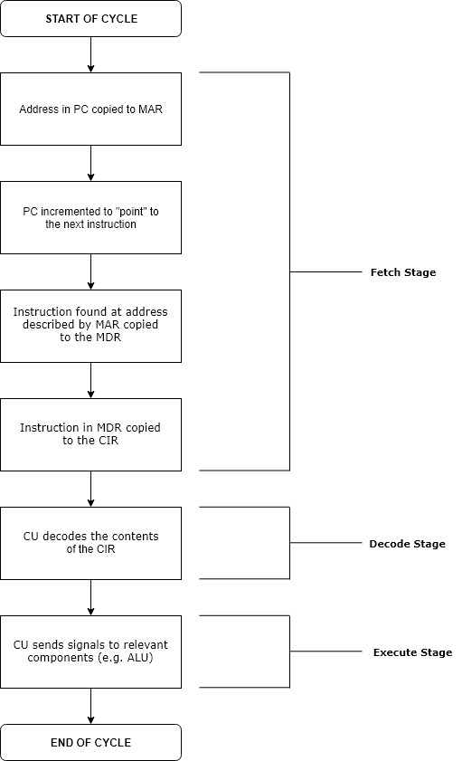
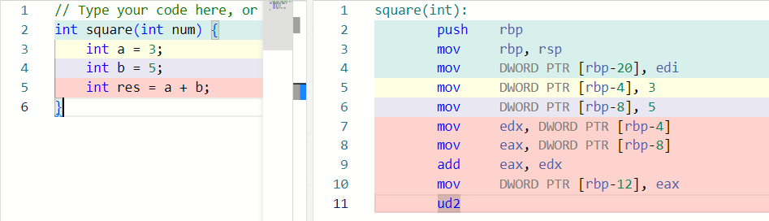

---
tags:
    - Programmierung
---

# Befehlsausführung

1. Der Befehlszählerinhalt wird auf den Adressbus gelegt.
2. Über den Datenbus wird der Operations-Code des Befehls ins Befehlsregister geladen.
3. Der Befehlszähler wird erhöht.
4. Der Befehl wird decodiert.
5. Wenn nötig (bei Mehrbytebefehlen) werden weitere Bytes des Befehls ins Befehlsregister geholt.
6. Der Befehl wird ausgeführt.

## Befehlsarten

-   Arithmetische Befehle (Grundrechenarten)
-   Logische Befehle (logische Grundverknüpfungen)
-   Registrieranweisungen
-   Sprungbefehle
-   Unterprogrammbehandlung

### Moderne Prozessoren 

-   Befehle für die Verarbeitung von Audio, Video und Grafik
-   kryptografische Befehle
-   Befehle für spezielle Anwendungen

_[Quelle](https://www.elektronik-kompendium.de/sites/com/1310171.htm)_

## C zu Assembler

